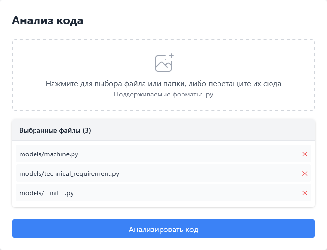
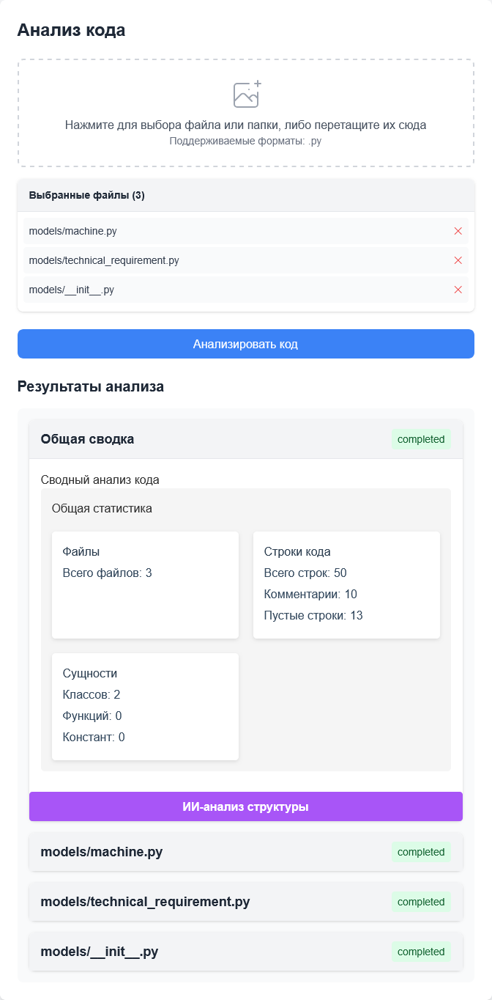
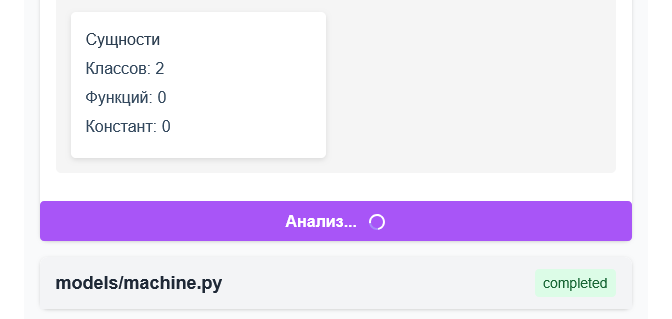
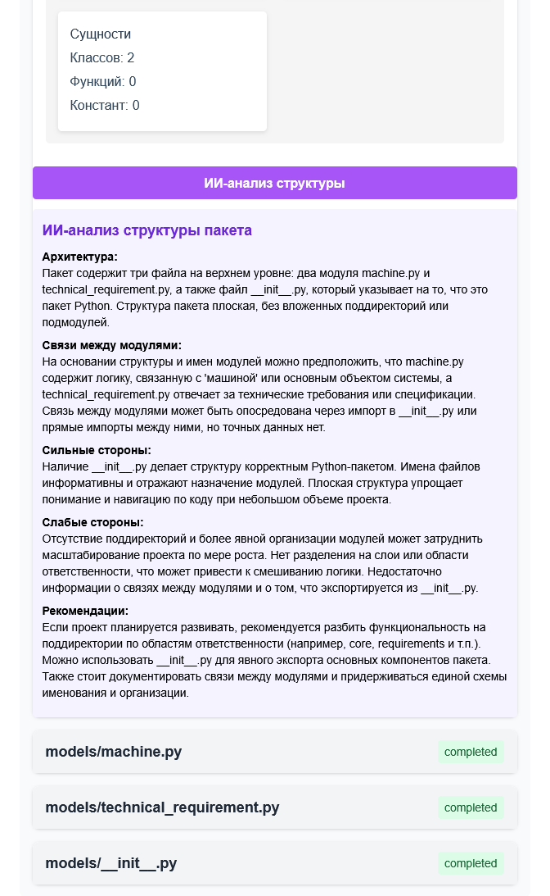
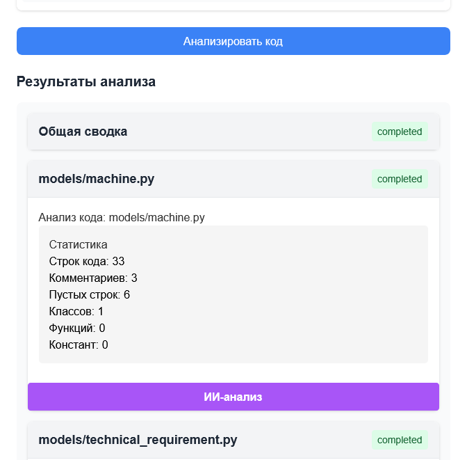
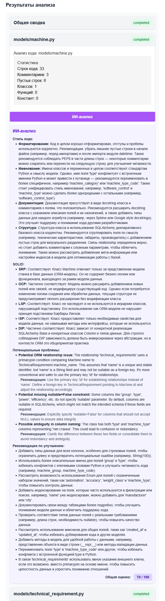
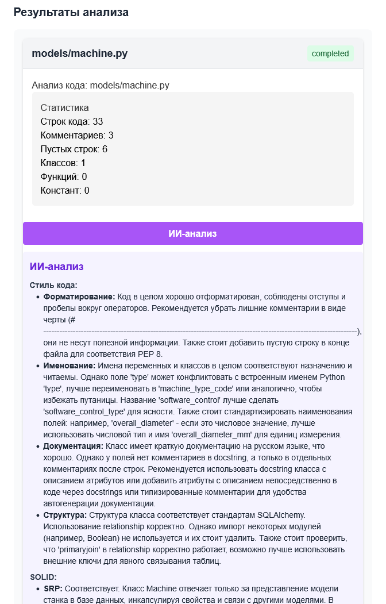

# Smart Code Analyzer

Интеллектуальный анализатор кода, который использует искусственный интеллект для анализа и улучшения качества кода.

## Возможности

- Анализ стиля кода
- Проверка соответствия принципам SOLID
- Выявление потенциальных проблем
- Предложения улучшений и оптимизаций
- Анализа безопасности кода
- Оценки качества кода

## Установка и запуск

### Вариант 1: Poetry (рекомендуется)
```bash
poetry add git+https://github.com/sad-engineer/smart_code_analyzer.git
```

### Вариант 2: pip
```bash
pip install git+https://github.com/sad-engineer/smart_code_analyzer.git
```

### Установите зависимости:
```bash
poetry install
```

### Запуск:

Запустите run.py или через консоль:
```bash
poetry run uvicorn smart_code_analyzer.backend.main:app --reload --host 0.0.0.0 --port 8000
```

- Веб-интерфейс будет доступен по адресу: http://localhost:8000
- Документация доступна по адресу: http://localhost:8000/docs, http://localhost:8000/redoc
- Метрики доступна по адресу: http://localhost:8000/metrics


## Использование

Взаимодействие с прораммой производится посредством веб страницы по адресу: http://localhost:8000

Созданный пользователем код нужно загрузить в окно загрузки кода


Загружать можно файлом или пакетом (в том числе, и с вложенными пакетами). 
После загрузки появится раскрывающийся список с количеством загруженных файлов.


Загруженные файлы можно посмотреть раскрыв список.



Кнопка "Анализировать код" запускает Parsing-анализ по загруженным файлам.
При загрузке кода пакетом, первый блок результатов анализа будет содержать общую сводку по пакету.



Блок отчета будет содержать:

Общая сводка:
- Всего файлов
- Количество строк кода
- Количество строк комментариев
- Количество пустых строк
- Количество классов
- Количество функций
- Количество констант

Индивидуальные результаты по каждому файлу в раскрывающихся блоках.

Здесь же можно запросить результаты ИИ-анализа структуры, кликнув по кнопке "ИИ-анализ структуры". 
Анализ может занять длительное время, о загрузке анализа сообщит информация на кнопке.



После загрузки ИИ-анализа, результаты будут доступны в блоке под кнопкой.



В анализе доступны  
- Рекомендации по архитектуры и организации модулей
- Как связаны модули между собой
- Сильные стороны структуры
- Слабые стороны структуры
- Общие рекомендации по улучшению пакета

Также, для каждого загруженного файла отображается:
- статус Parsing-анализа (например, "completed"), 
- результат этого анализа (в раскрывающемся списке)
- кнопка запроса ИИ-анализа кода файла.

Эту информацию можно получить раскрыв блок с именем соответствующего файла. 
Так же, для каждого файла доступна кнопка "ИИ-анализ".



Анализ фала :
- Оценка и рекомендации стиля кода
- Оценка и рекомендации по соответствию принципам SOLID
- Оценка и рекомендации на предмет потенциальных проблем
- Оценка и рекомендации по улучшению кода



При загрузке одного файла, доступны все механики для файла (включая ИИ-анализ файла) 




## Структура проекта

```
smart_code_analyzer/
├── backend/                  # Backend на FastAPI
│   ├── ai_analyzer.py        # Класс ИИ-анализатора
│   ├── analyzer_api.py       # API endpoints
│   ├── Dockerfile.backend    # Dockerfile для backend
│   ├── main.py               # Точка входа
│   ├── models.py             # Модели данных
│   └── __init__.py
├── frontend/                 # Frontend на React
│   ├── src/
│   │   ├── App.tsx
│   │   └── input.css
│   ├── static/
│   │   └── js/
│   │       └── main.js
│   ├── templates/
│   │   └── index.html
│   ├── Dockerfile.frontend
│   ├── package.json
│   └── tailwind.config.js
├── .env                      # Конфигурация окружения
├── docker-compose.yml        # Docker Compose конфигурация
├── prometheus.yml            # Конфигурация Prometheus
├── run.py                    # Скрипт запуска
│   ├── start_prometheus
│   └── start_grafana
└── start.bat                 # Скрипт запуска для Windows
```
